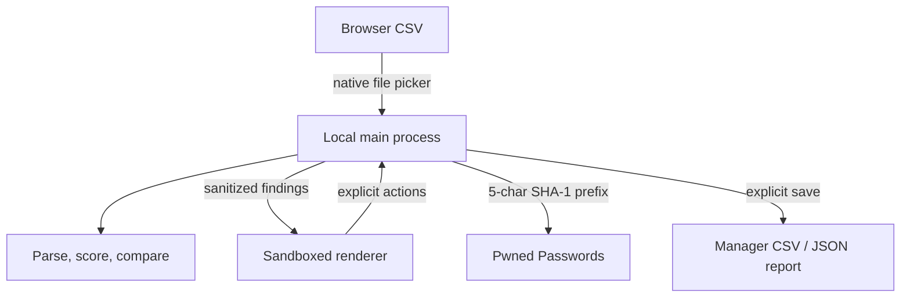

# VaultMedic

VaultMedic is a local desktop password-health and rotation assistant. It opens a browser password export on your computer, finds weak, reused, and compromised passwords, then helps you work through each account safely.

It does **not** upload the password file and it does **not** claim to change every password automatically. Websites have different forms, CAPTCHAs, authentication steps, MFA challenges, recovery flows, and password rules. VaultMedic is a rotation assistant: the user stays in control of every website interaction.

> Status: security-focused MVP. Please read [THREAT_MODEL.md](THREAT_MODEL.md) before using real credentials.

The desktop interface uses a locally bundled pixel font and a light monochrome theme. No font, stylesheet, analytics event, or imported credential is fetched by the renderer.

## What works

- Chrome-compatible and Firefox CSV import
- Local strength analysis powered by `zxcvbn-ts`
- Exact password-reuse detection inside the current session
- Compromised-password checks using the Have I Been Pwned range API
- Cryptographically secure unique password generator
- Per-account rotation, MFA, passkey, and manager checklist
- Progress dashboard and password-free JSON report
- Standard `/.well-known/change-password` links for each valid HTTPS origin
- Explicit browser/password-manager-compatible CSV export
- Recoverable “move source CSV to Trash” action
- Safe built-in demo with fictional accounts

## Privacy design

The Electron renderer never receives the imported CSV, its filesystem path, or the complete list of plaintext passwords. Parsing, analysis, reuse matching, breach hashing, clipboard handling, and export generation run in the main desktop process. The renderer receives sanitized findings and can request one secret only after an explicit reveal action.

The renderer has:

- `nodeIntegration: false`
- `contextIsolation: true`
- Chromium sandboxing enabled
- no network connection permission in its Content Security Policy
- denied browser permissions, popups, webviews, and in-window navigation

The only application network destination is the fixed Pwned Passwords range endpoint. When the user starts a check, VaultMedic computes SHA-1 locally, sends the first five hexadecimal characters, requests padded results with `Add-Padding: true`, and performs the suffix comparison locally. The complete password and complete hash are never sent. See the [official Pwned Passwords API documentation](https://haveibeenpwned.com/API/V3#SearchingPwnedPasswordsByRange).

Firefox warns that exported passwords are readable and must not be uploaded, emailed, or shared, and recommends deleting the export when finished. Chrome likewise warns that anyone with access to the CSV can read it and says to delete it after import. See [Firefox export guidance](https://support.mozilla.org/en-US/kb/export-login-data-firefox) and [Chrome import/export guidance](https://support.google.com/chrome/answer/13068232?co=GENIE.Platform%3DDesktop&hl=en).

## Run locally

Prerequisites:

- Node.js 24 or later
- npm 11 or later
- platform prerequisites required by Electron packaging

```bash
git clone https://github.com/YOUR_USERNAME/vaultmedic.git
cd vaultmedic
npm ci
npm run dev
```

Run the complete verification suite:

```bash
npm run check
```

Create an unpacked app for the current platform:

```bash
npm run dist
```

Create distributable installers:

```bash
npm run package
```

Create the Windows installer and portable executable on Windows:

```bash
npm run package:win
```

Create the unpacked Windows application without an installer wrapper:

```bash
npm run package:win:unpacked
```

If the portable EXE is blocked or closes before showing a window, use the unpacked ZIP from the release. Extract it into its own folder, keep all included files together, and open `VaultMedic.exe`.

Tagged releases are also built on a clean Windows GitHub Actions runner. See [GITHUB_RELEASE.md](GITHUB_RELEASE.md) for the exact first upload and release steps.

Production releases should be code-signed and built in isolated CI runners. This repository intentionally does not ship placeholder signing credentials.

## Architecture



More detail is in [docs/ARCHITECTURE.md](docs/ARCHITECTURE.md).

## Export warning

Password-manager CSV files are plaintext. VaultMedic only writes one after a clear user action and uses owner-only file permissions where the operating system supports POSIX modes. Import the file, verify that the new credentials work, and delete the CSV immediately afterward.

The password-free JSON report contains websites and usernames. It does not contain passwords, but it can still reveal which services you use; store it accordingly.

## Security and contributing

- [Threat model](THREAT_MODEL.md)
- [Security policy](SECURITY.md)
- [Privacy policy](PRIVACY.md)
- [Contributing guide](CONTRIBUTING.md)
- [Code of conduct](CODE_OF_CONDUCT.md)
- [Changelog](CHANGELOG.md)
- [GitHub release guide](GITHUB_RELEASE.md)

Security fixes are welcome, but please report exploitable issues privately through GitHub Security Advisories before opening a public issue.

## License

[MIT](LICENSE)
