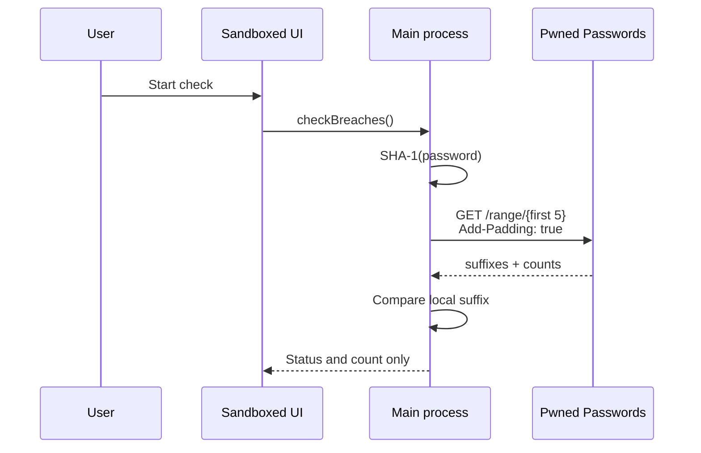

# Architecture

VaultMedic is an Electron desktop application with three code domains.

## Main process (`src/main`)

The main process is the only domain that opens and parses files. It stores imported and staged passwords in an in-memory `VaultSession`. It also owns:

- zxcvbn and heuristic password analysis;
- session-only SHA-256 fingerprints for exact reuse groups;
- SHA-1 prefix creation and HIBP range-response comparison;
- cryptographic generation via Node.js `crypto.randomInt`;
- conditional clipboard expiry;
- native save and Trash actions;
- HTTPS external-link validation;
- password-manager CSV and password-free JSON generation.

No general-purpose logger is initialized. Expected user errors are converted to fixed or bounded messages that do not contain input records.

## Preload boundary (`src/preload`)

The context-isolated preload exposes a frozen, task-specific API. It does not expose Electron, Node.js, raw IPC, filesystem paths, or arbitrary channels.

IPC inputs are validated again in the main process. Each request verifies that the sender frame is the packaged file origin or the fixed local development origin.

## Renderer (`src/renderer`)

The React renderer receives `VaultSnapshot` objects containing account identifiers, websites, usernames, scores, findings, checklist values, and guidance links. Snapshot objects do not contain passwords, notes, source paths, reuse hashes, or complete password hashes.

One secret can enter the renderer only through:

- an explicit reveal action;
- a newly generated password returned for display;
- a manually typed replacement.

The renderer is sandboxed and its CSP forbids network connections. All popups, webviews, permission requests, and in-app navigation are denied.

## Breach lookup sequence



Exact duplicate passwords share one request per session. Prefix response bodies are cached in memory and dropped when the vault clears.

## Change-password navigation

For each valid imported HTTP or HTTPS URL, VaultMedic extracts the host, removes any embedded credentials, upgrades the displayed origin to HTTPS, and builds:

```text
https://host.example/.well-known/change-password
```

This follows the W3C [change-password URL](https://www.w3.org/TR/change-password-url/) specification. The destination opens in the operating system’s default browser. VaultMedic does not load remote websites in its own renderer and cannot guarantee that a site implements the route.

## Exports

The manager CSV uses the broadly supported columns `name,url,username,password,note`. It is intentionally generic; password managers may have additional product-specific formats. A future adapter must remain an explicit local export and add round-trip fixture tests.

The JSON report has schema identifier `org.vaultmedic.security-report/v1` and explicitly declares `containsPasswords: false`.
